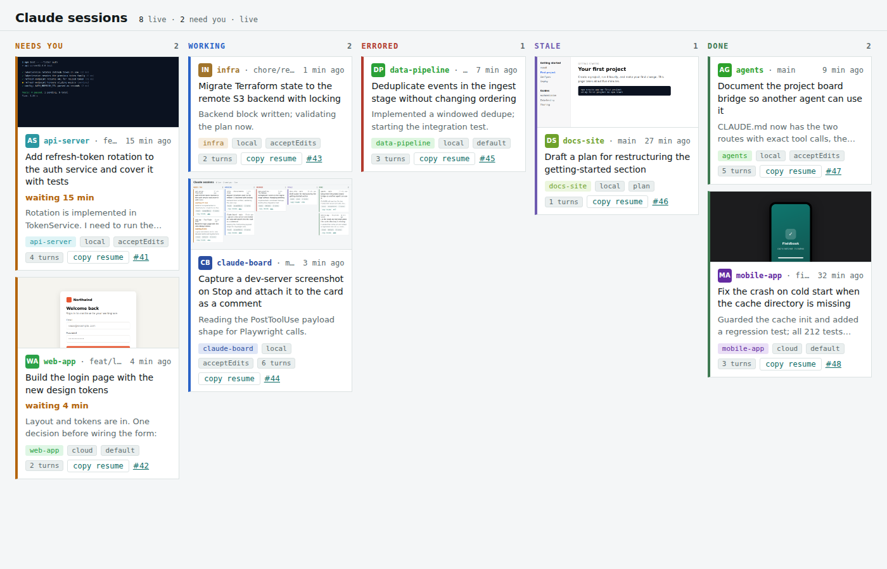
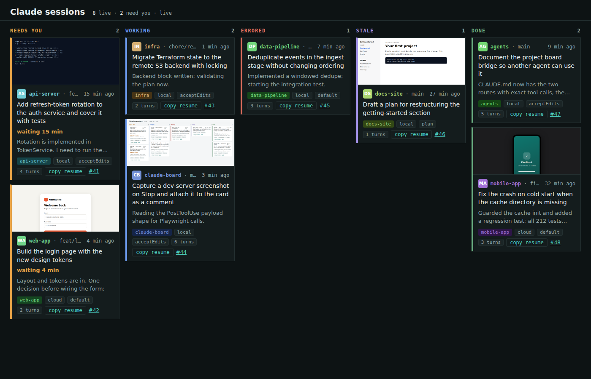
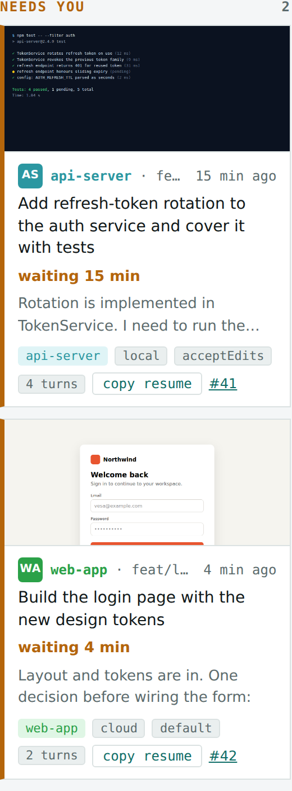
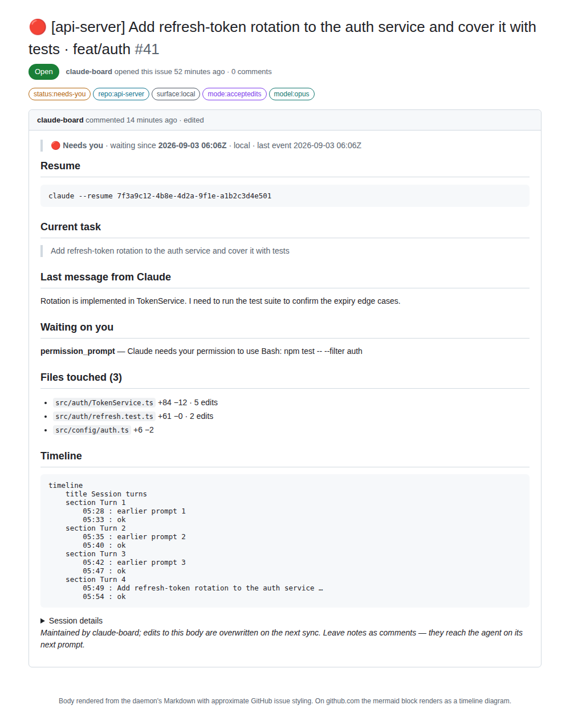
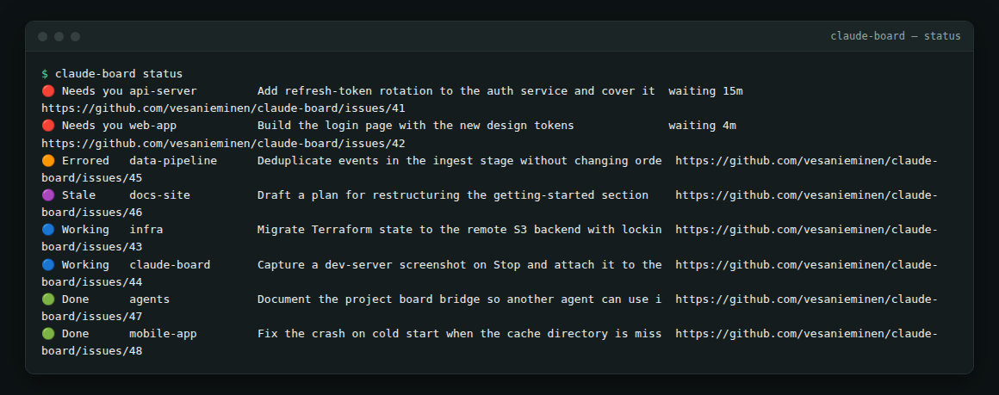
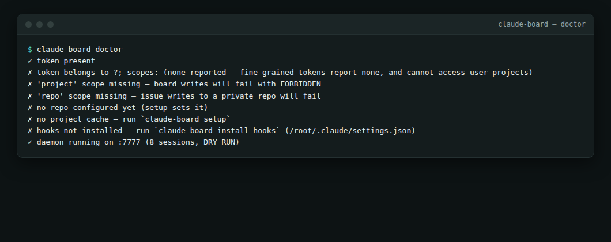
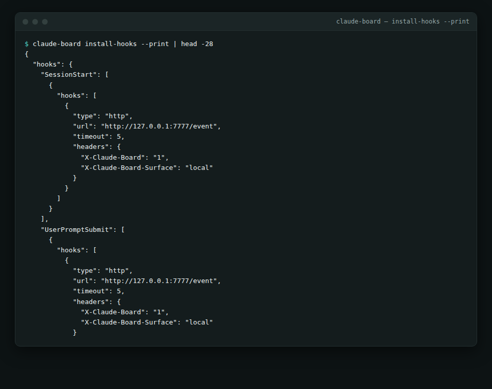

# claude-board

A live Kanban board of your Claude Code sessions. Every session becomes a card
on a GitHub Projects board; the column tells you what it needs from you.

```
CLI · IDE · Desktop ──http hooks──▶ daemon :7777 ──REST + GraphQL──▶ GitHub Projects
cloud sessions ─────http hooks via tunnel──▶   │
                                               └──▶ local dashboard  http://127.0.0.1:7777
```

| Column | Set by |
|---|---|
| 🔵 **Working** | `UserPromptSubmit` — you sent a prompt, the agent is on it |
| 🔴 **Needs you** | `Notification` of type `permission_prompt`, `agent_needs_input`, `elicitation_*` |
| 🟠 **Errored** | `StopFailure` — rate limit, overload, auth, and friends |
| 🟢 **Done** | `Stop` or `Notification/agent_completed` — a turn finished; output is waiting |
| 🟣 **Stale** | Working with no events for 10 minutes — probably dead or stuck |
| ⚫ closed | `SessionEnd` — issue closed, card archived |

**Needs you** is the point. Filter a saved view to that column and you have an
inbox, sorted by the `Waiting (min)` field so the session stuck longest is on top.

Zero dependencies. Node 20+.

## What it looks like

The local dashboard, with example sessions in every column. The left stripe is the
column's status color; each project has its own color for the monogram tile, name
and chip, so `api-server` looks the same wherever it shows up. Sessions that have
something to show carry a thumbnail. Needs-you cards sort by how long they've been
waiting; every card has a copy-to-clipboard resume command.







A card opened on GitHub: the issue body the daemon maintains for the top
Needs-you session. Shown here with approximate styling; on github.com the
Mermaid block renders as a timeline diagram.



The CLI: `status` as an inbox, `doctor` checking every prerequisite (here run
without a real token, so it points at what to fix), and the hook snippet
`install-hooks --print` would merge into `~/.claude/settings.json`.







## Five-minute setup

1. **Token.** Create a **classic** personal access token with the `project` and
   `repo` scopes: <https://github.com/settings/tokens/new?scopes=project,repo&description=claude-board>.
   A fine-grained token will not work — its Projects permission only exists for
   organizations, so a user-owned board cannot be granted it.

2. **Setup** creates a private `claude-board` issues repo, a "Claude sessions"
   project with the five Status columns and six custom fields, and the labels.
   Idempotent; rerun any time — it finds what already exists.

   ```bash
   git clone https://github.com/vesanieminen/claude-board && cd claude-board
   export CLAUDE_BOARD_GITHUB_TOKEN=ghp_...
   node bin/claude-board.js setup
   ```

   Optional: `npm link` puts a `claude-board` command on your PATH so the
   remaining steps drop the `node bin/…` prefix.

3. **Hooks.** Adds `http` hooks for eleven events to `~/.claude/settings.json`
   (backing it up first). New sessions report from their next start.

   ```bash
   node bin/claude-board.js install-hooks
   ```

4. **Run the daemon** and leave it running. Dashboard at <http://127.0.0.1:7777>.

   ```bash
   node bin/claude-board.js serve
   ```

5. Open the project URL that `setup` printed, switch the view to **Board**, group
   by **Status**. Start a Claude Code session anywhere and watch the card appear.

`node bin/claude-board.js doctor` checks every one of these.

## What lands on the card

**Title** — `🔴 [api-server] Add refresh-token rotation and tests · feat/auth`.
Emoji is the one color that renders everywhere; it updates on every state change.

**Labels** (colored, always visible on the card face) — `status:needs-you`,
`repo:api-server`, `surface:local|cloud`, `mode:acceptedits`, `model:opus`.

**Fields** — `Waiting (min)`, `Last activity`, `Turns`, `Files touched`, `Branch`,
`Session`. Pin the ones you want on the card face in the view settings.

**Body** — a living document rewritten on every sync:

- the resume command (`claude --resume <id>`, or `--teleport` for cloud sessions) and `cd`
- the current prompt, and Claude's last message (from `Stop.last_assistant_message`)
- what it's waiting on, when in Needs you
- files touched with `+adds −dels` from the edit tools' `gitDiff`
- tasks as a checklist (GitHub renders `3/7` on the card), subagents
- a Mermaid `timeline` of the last eight turns
- collapsed session details

Card faces never render images from the body. If you want screenshots at a
glance, that's what the local dashboard is for.

## Project colors

Every repository gets a color derived from its name, the same on both surfaces:
on GitHub it's the color of the `repo:<name>` label, on the dashboard it's the
monogram tile, the repo name and the project chip. Status stays the dominant
signal (column, left stripe, title emoji); project color is the second glance
that tells two Working cards apart. No configuration — `api-server` is the same
hue on every machine.

## Thumbnails

A session can carry an image, shown full-width on its dashboard card. Card faces
on GitHub never render images, so this is dashboard-first; the issue body embeds
it only when a public URL is known (`thumbnailUrl`), which nothing sets today.

Three ways a thumbnail gets set, in the order you'll use them:

1. **The agent decides.** If a session writes `.claude-board/thumbnail.png` (or
   `.jpg` / `.webp`) inside its working directory, the `PostToolUse` hook already
   installed notices the write and the daemon picks the file up. Add one line to
   a project's `CLAUDE.md` — *"when you have built something visual, save a
   screenshot to `.claude-board/thumbnail.png`"* — and agents working on UI will
   do it while agents refactoring a parser won't. Add `.claude-board/` to that
   project's `.gitignore`.

2. **Anything with curl.** A skill, a hook command, or the agent itself:

   ```bash
   curl -X POST -H 'Content-Type: image/png' --data-binary @shot.png \
     http://127.0.0.1:7777/sessions/<session_id>/thumbnail
   ```

   Same auth rule as `/event`: loopback is open, anything else needs the bearer.
   Up to 3 MB; PNG, JPEG or WebP.

3. **Capture on Stop.** Not built in — every project's dev server is different.
   A `Stop` command hook that runs `playwright screenshot <url> .claude-board/thumbnail.png`
   gets you there in two lines, and route 1 takes over from there.

Thumbnails live in `~/.claude-board/thumbs/` and are served at `/thumbs/<file>`.

## Talk back to a session

Leave a comment on a card. On the agent's next `UserPromptSubmit` the daemon
returns any comments newer than its last look as `additionalContext`, so
"also run the linter when you're done" reaches the agent with your next prompt.
The fetch has a 2-second budget so it can never stall the prompt.

## Cloud sessions

Claude Code on the web runs in isolated VMs. They don't read your
`~/.claude/settings.json` and can't reach `localhost`. To put them on the board:

1. Expose the daemon (`cloudflared tunnel`, `ngrok`, `tailscale funnel`) and bind
   it to all interfaces with a shared secret:

   ```bash
   CLAUDE_BOARD_HOST=0.0.0.0 CLAUDE_BOARD_TOKEN=<long random string> node bin/claude-board.js serve
   ```

2. Print the hook snippet for that URL and commit it as `.claude/settings.json`
   in the repositories your cloud sessions clone:

   ```bash
   node bin/claude-board.js install-hooks --cloud https://board.your-tunnel.example
   ```

3. Set `CLAUDE_BOARD_TOKEN` to the same value in the cloud environment's variables.

Requests from anywhere but loopback must carry that bearer token; without a
configured token, non-loopback requests are refused outright.

## Configuration

Environment variables win over `~/.claude-board/config.json`.

| Variable | Default | Meaning |
|---|---|---|
| `CLAUDE_BOARD_GITHUB_TOKEN` | `GITHUB_TOKEN` | classic PAT, `project` + `repo` |
| `CLAUDE_BOARD_REPO` | `<you>/claude-board` | repo that holds the session issues |
| `CLAUDE_BOARD_PROJECT_TITLE` | `Claude sessions` | project board title |
| `CLAUDE_BOARD_PORT` | `7777` | daemon port |
| `CLAUDE_BOARD_HOST` | `127.0.0.1` | bind address; `0.0.0.0` behind a tunnel |
| `CLAUDE_BOARD_TOKEN` | — | bearer required from non-loopback callers |
| `CLAUDE_BOARD_SYNC_MS` | `3000` | debounce between GitHub writes |
| `CLAUDE_BOARD_STALE_MIN` | `10` | minutes of silence before Stale |
| `CLAUDE_BOARD_NEEDS_YOU` | `permission_prompt,agent_needs_input,elicitation_dialog,elicitation_url_dialog` | notification types that mean Needs you |
| `CLAUDE_BOARD_DRY_RUN` | — | `1` to log instead of writing to GitHub |
| `CLAUDE_BOARD_DATA_DIR` | `~/.claude-board` | config, session store, project cache |

`idle_prompt` is deliberately *not* a Needs-you trigger: it fires a minute after
every finished turn, which would drain the Done column into the inbox.

## How it works

Hooks POST their JSON to `/event`. The daemon folds each event into a per-session
record with a pure state machine (`src/machine.js`), persists it, and marks the
session dirty. Every `syncMs` the dirty set is flushed: one REST issue write and
one aliased GraphQL mutation per session, skipped entirely when nothing changed.

Projects v2 addresses everything by node ID and a single-select field can't be
set by name, so `setup` resolves the project, field and option IDs once and
caches them in `~/.claude-board/project.json`. Per event, only the item ID varies.

If the session→issue map is lost, the daemon searches the repo for the
`<!-- claude-board:session=… -->` marker before creating a duplicate.

Closed sessions are pruned from the local store after a week; their issues stay.

## Commands

```
setup              create repo, project, fields, labels (idempotent)
install-hooks      merge hooks into ~/.claude/settings.json (--print to preview, --cloud URL for the cloud snippet)
uninstall-hooks    remove them
serve              run the daemon (default)
status             live sessions from the local store
doctor             token scopes, repo, project cache, hooks, daemon
```

## Tests

```bash
npm test                                          # unit: state machine, renderer, hook merging
CLAUDE_BOARD_GITHUB_TOKEN=... node test/smoke.js  # end to end against GitHub; walks a card across every column
```

`test/smoke.js` runs on a GitHub Actions runner via
`.github/workflows/claude-board-smoke.yml` in the parent repo, which is how the
GraphQL path was verified from an environment where GraphQL itself is blocked.

## Known limits

- Card faces show title, labels, assignees and pinned fields — no images.
- Label → status is one-way: dragging a card by hand doesn't change its labels; the next event overwrites it anyway.
- No screenshot capture. Wire your own `PostToolUse` hook for that and link the image from a comment.
- `SessionStart` doesn't fire in `-p` (print) mode; the first event of any kind creates the card.
